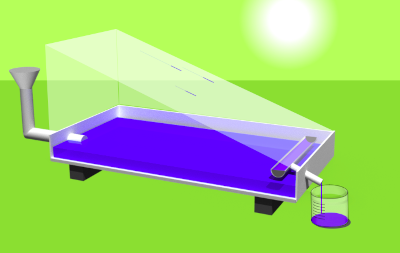

# Solar Still Simulation, HTML5

An educational simulation that encourages students to explore an engineering problem. A solar still uses sunlight to evaporate and desalinate water. The amount of water that can be generated with the still will vary depending on the type of glass, the amount of insulation, and more. This was dveloped using HTML5 and uses functional reactive programming techniques. 3-D artwork by myself.

